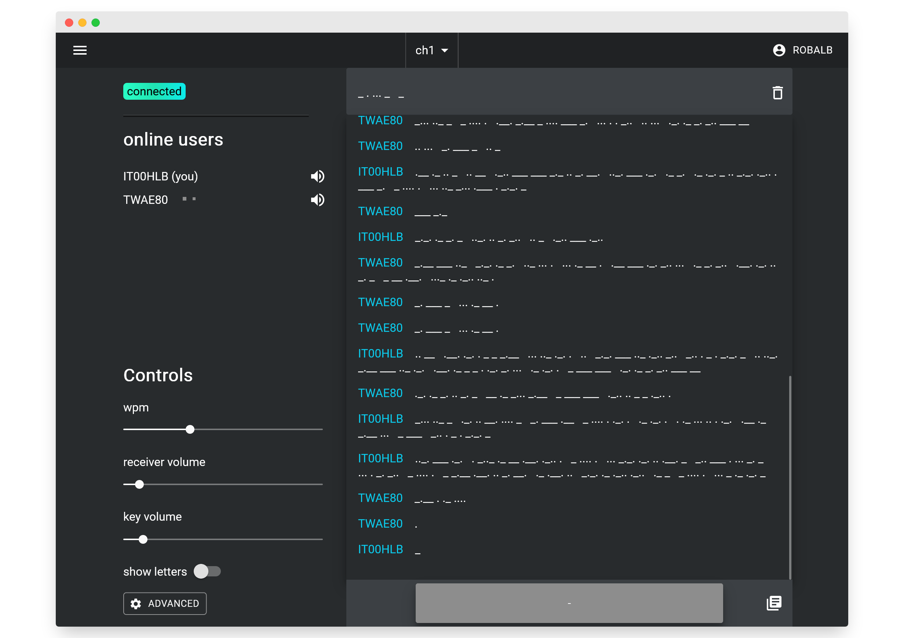
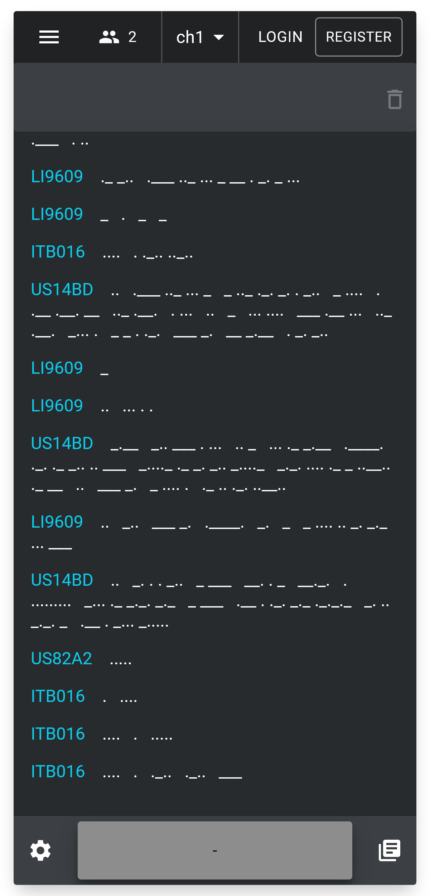

#  Morsechat 

An online morse code chat, allowing users from all over the world to practice and communicate in morse code without the need for expensive equipment. Live at [morse.halb.it](https://morse.halb.it/)

[support the project](https://ko-fi.com/K3K6D3NPD)

## screenshots

<!--
w 600 200
h 500 400
-->

## configuration

Copy the file env.example into .env

in the .env configure your pusher credentials.
You can generate them from your self-hosted instance of socketi (see socketi.app)
Or you can use pusher.com

## development

clone this repository `git clone https://github.com/robalb/morsechat.git`

navigate into the repository `cd morsechat`

start the api server in development mode `docker-compose up`

start vite in development mode `cd /web && npm run dev`

## production

The easiest way to run the webapp in a production environment is with the provided docker-compose.prod,
`docker-compose -f docker-compose.prod.yml up --build`
This method will also generate and manage a mariadb image, but you should replace it with something more stable

Alternatively you can deploy the app on a k8s kluster using the manifests in `kubernetes/base` but first you will need to
setup on your own a traefik ingress controller, certmanager, and a mariadb database Service.
The nginx webserver is configured to handle X-Forwarder-For headers coming from an ingress with proxy protocol enabled.
You can configure it in flaskapp.conf

The live website on halb.it is built using github workflows, and deployed on a k8s cluster with argoCD

